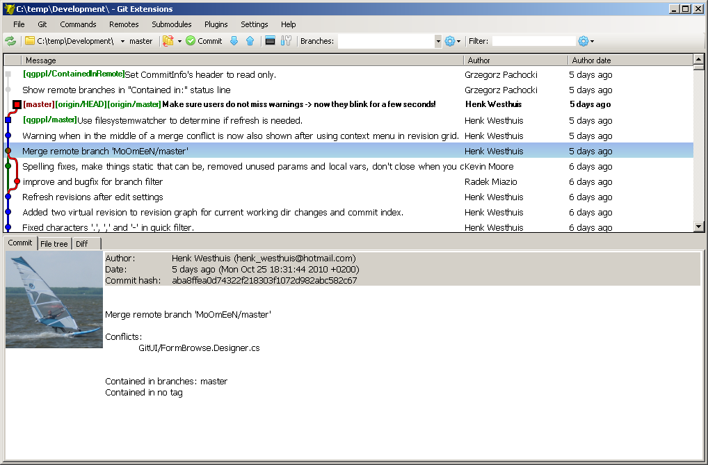
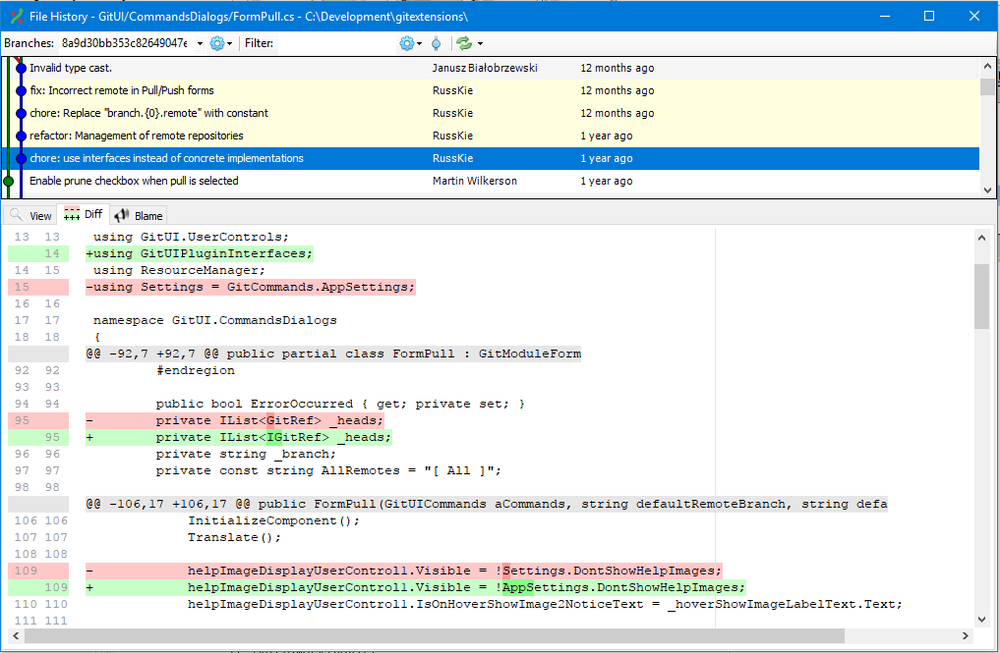
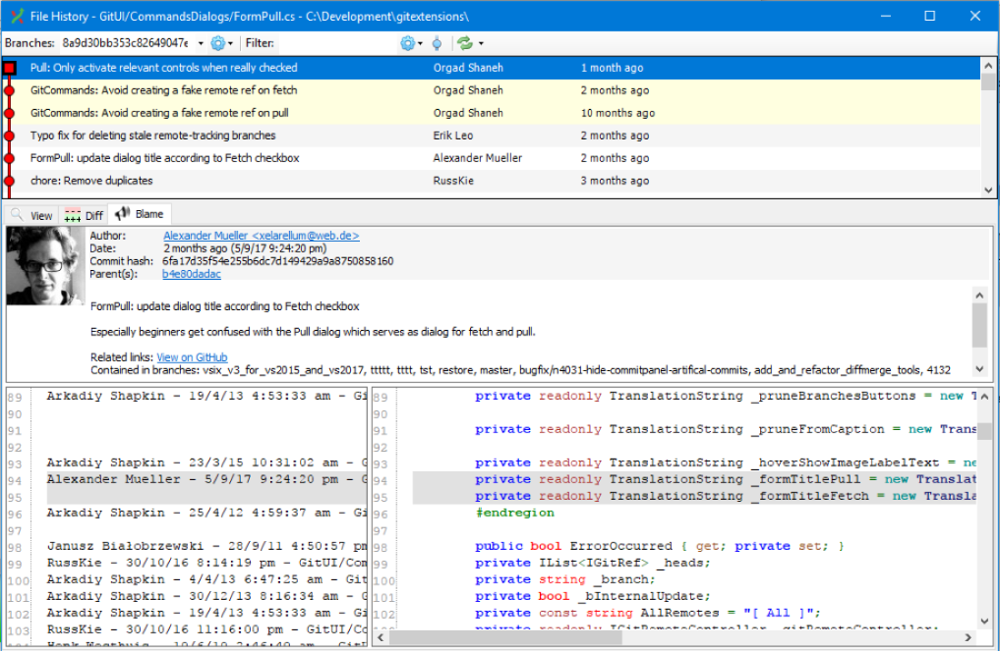
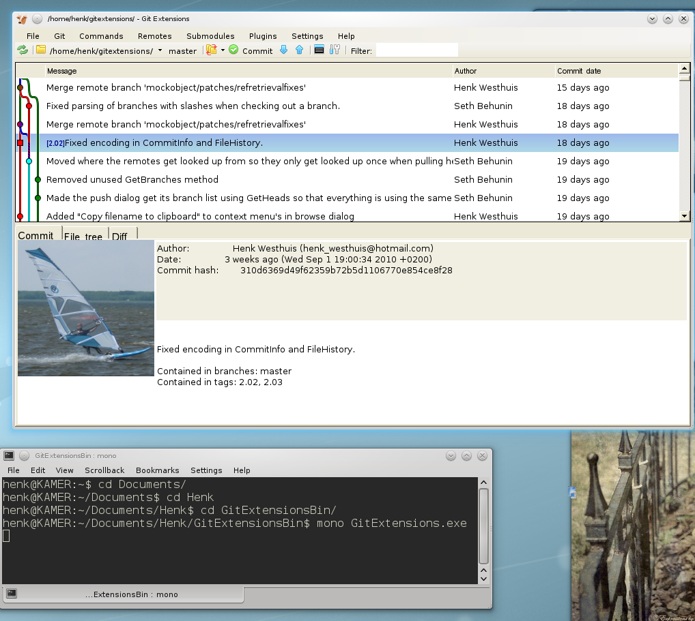

  * [Online manual](https://git-extensions-documentation.readthedocs.org/)
  * [Issue tracker](http://github.com/gitextensions/gitextensions/issues)
  * [Our gitter channel](https://gitter.im/gitextensions/gitextensions?utm_source=badge&utm_medium=badge&utm_campaign=pr-badge&utm_content=badge)
  * [Donate via OpenCollective](https://opencollective.com/gitextensions)

## Features

  * Windows Explorer integration for Git
  * Visual Studio plugin
      * 2022 [download](https://marketplace.visualstudio.com/items?itemName=GitExtensionsApp.VS2022)
      * 2015/2017/2019 [download](https://marketplace.visualstudio.com/items?itemName=GitExtensionsApp.v341)
  * Feature rich user interface for Git

## View Commit Log

The full commit history can be browsed. Branches are shown using a graph which highlights commits that are included in the current revision.

## File History

Explore the history of single files. Renamed and moved files are matched and shown in a single history. You do not need to mark files as renamed/moved. The system detects renamed files automatically.

## Blame

Find the last person that edited a specific part of a file. Double click on the line shows the commit and allows you to drill-down to other files.

## Multi Platform

Version 2.x of Git Extensions runs on multiple platforms using Mono.

## Active Community

The active community of Git Extensions is supporting Git Extensions since 2008.

More information in the [Git repo](http://github.com/gitextensions/gitextensions/issues).

Generated from the following [Git repo](https://github.com/gitextensions/gitextensions.github.io).
